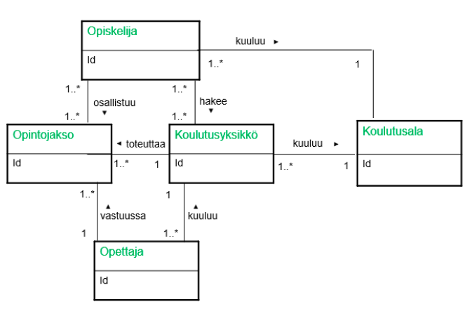

# tietokanta-alusta-loppuun  
  
Laadin kuvitteellisesta koulusta ER-mallin käyttäen UML-kuvauskieltä.  
  
  
Koulutusyksiköitä voi olla monia. Hakijat jotka pääsevät johonkin koulutusyksikköön, kirjataan koulutusalalle Tekniikka.  
Jokainen opiskelija osallistuu ainakin yhteen opintojaksoon. Jokainen koulutusyksikkö toteuttaa ainakin yhten opintojakson.  
Jokaisessa koulutusyksikössä on ainakin yksi opettaja. Jokaisella opettajalla on vastuullaan ainakin yksi opintojakso.  
  
Tiedot ovat keksittyjä.  
  
Tiedostossa testit.sql on testikyselyitä.